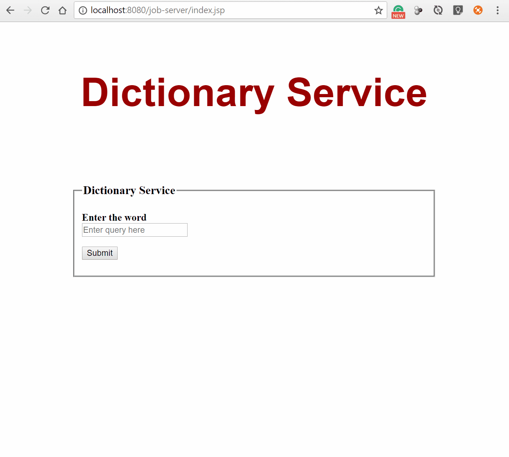
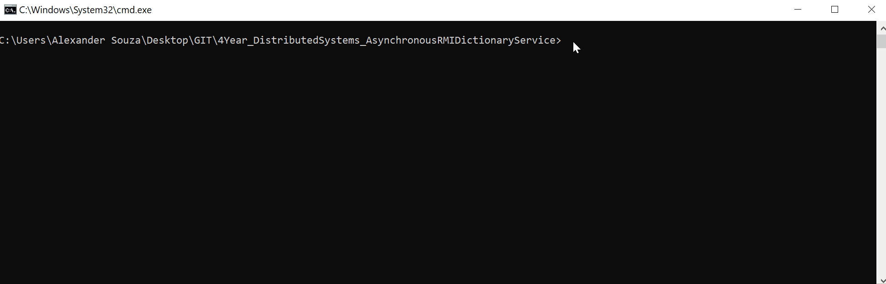

# 4Year Distributed Systems  
## Asynchronous RMI Dictionary Service

### Overview
You are required to use the Servlet/JSP and Java RMI frameworks to develop a remote, asynchronous dictionary lookup service. A JSP page should provide users with the ability to specify a string which will be checked against the dictionary. The HTML form information should be dispatched to a servlet that adds the client request to an in-queue and then returns a job ID to the web client. The web client should poll the web server periodically (every 10 seconds) and query if the request has been processed. Client requests in the inQueue should
be periodically removed and processed (every 10 seconds).

The processing of a client request will require a RMI method invocation to a remote object which implements an interface called DictionaryService. The remote object which implements DictionaryService should check if the string received exists in the dictionary, and return the dictionary definition of the string if it does exist in the dictionary, or “String not found” if it does not exist in the dictionary. Once the result of the dictionary lookup has been computed by the remote object, the returned response should be added to the outQueue on the Tomcat server and returned to the original web client when they next poll the server. The following diagram depicts the overall system architecture:




# INSTRUCTIONS FOR USE
## SERVER 
### SKIP OPTIONS 1 AND 2 IF THE "JAR" FILE IS ALREADY CREATED:

### 1. CEATING "class" FILE

Inside "SRC folder" - you can create the "Class" file using the following command from :
```
javac -cp servlet-api.jar ie/gmit/sw/*.java
```

### 2. CEATING "JAR" FILE:
```
jar -cf dictionary-service.jar ie/gmit/sw/*.class
```

### 3. STARTING THE SERVER:
```
java -cp dictionary-service.jar ie.gmit.sw.ServiceSetup
```




## CLIENT 
### SKIP OPTIONS 1 IF THE "WAR" FILE IS ALREADY CREATED:

### 1. INTO THE FOLDER "WebContent" CEATING WAR FILE:
```
jar –cf job-server.war *
```
### 2. COPY THE WAR FILE TO THE "C:\Program Files\Apache Software Foundation\Tomcat 8.5\webapps"  FOLDER, AND START TOMCAT8.


